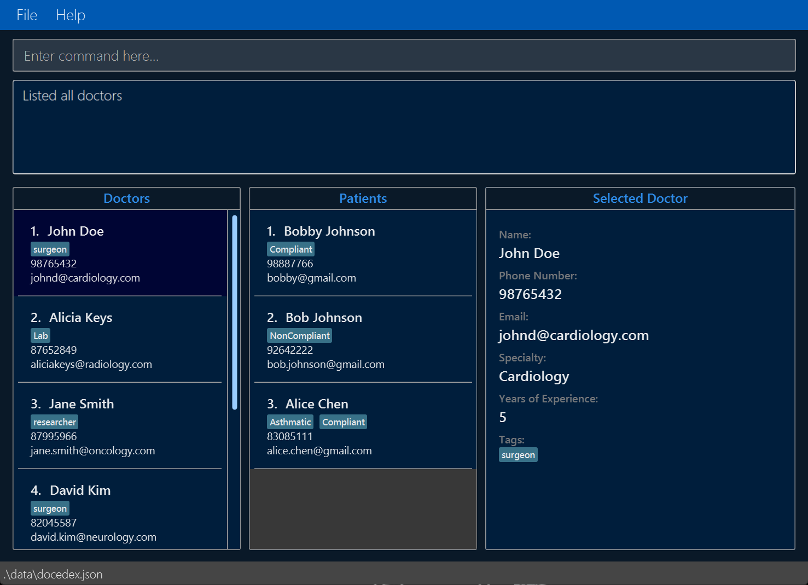
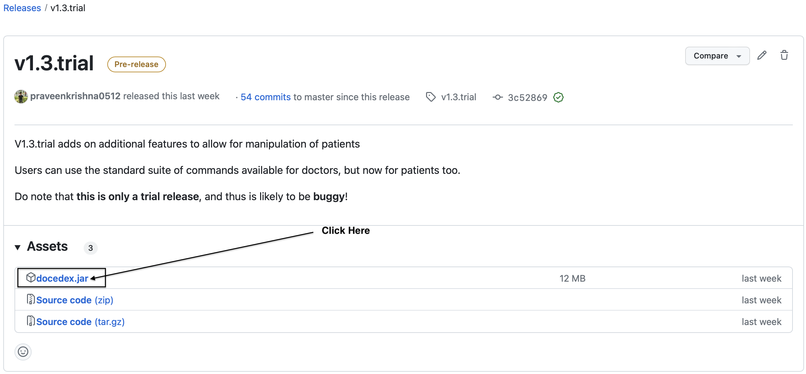
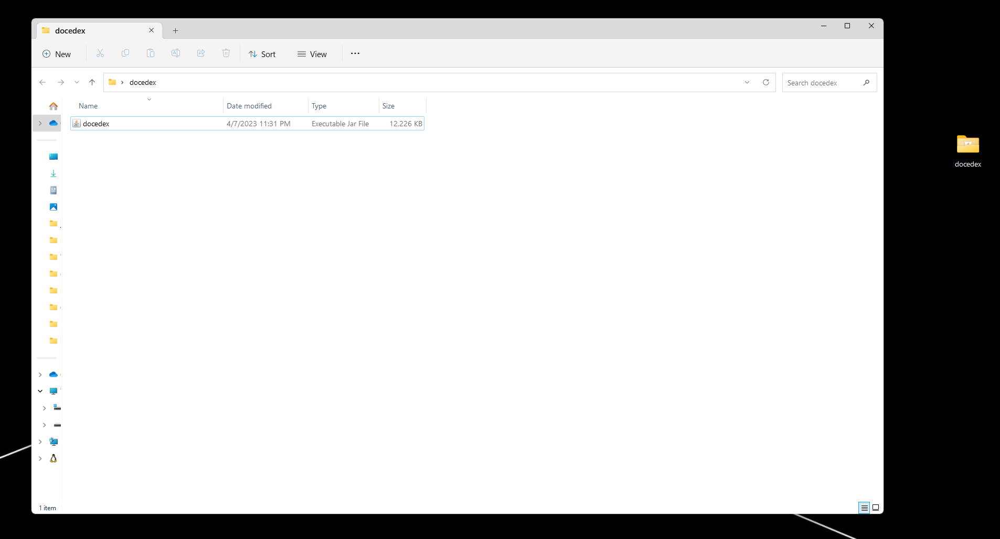
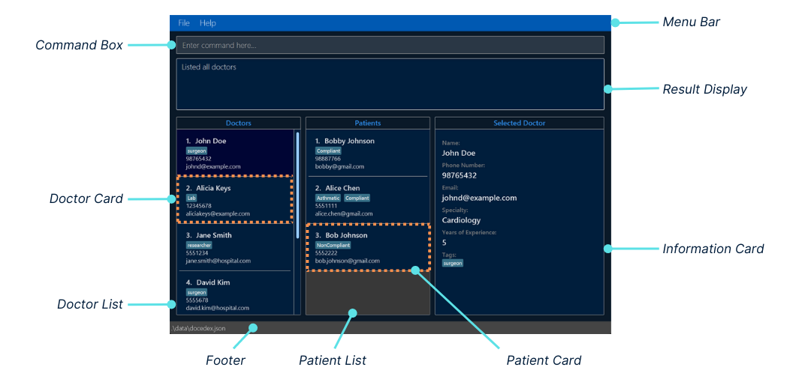
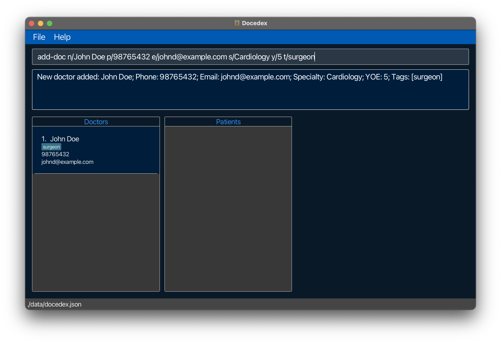
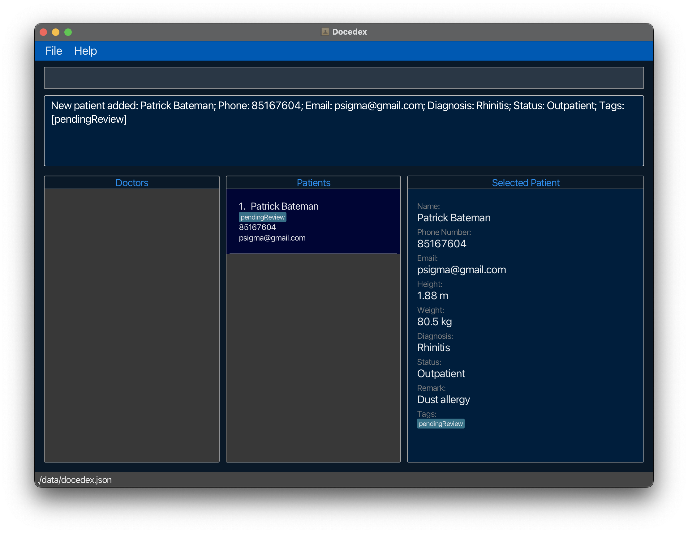
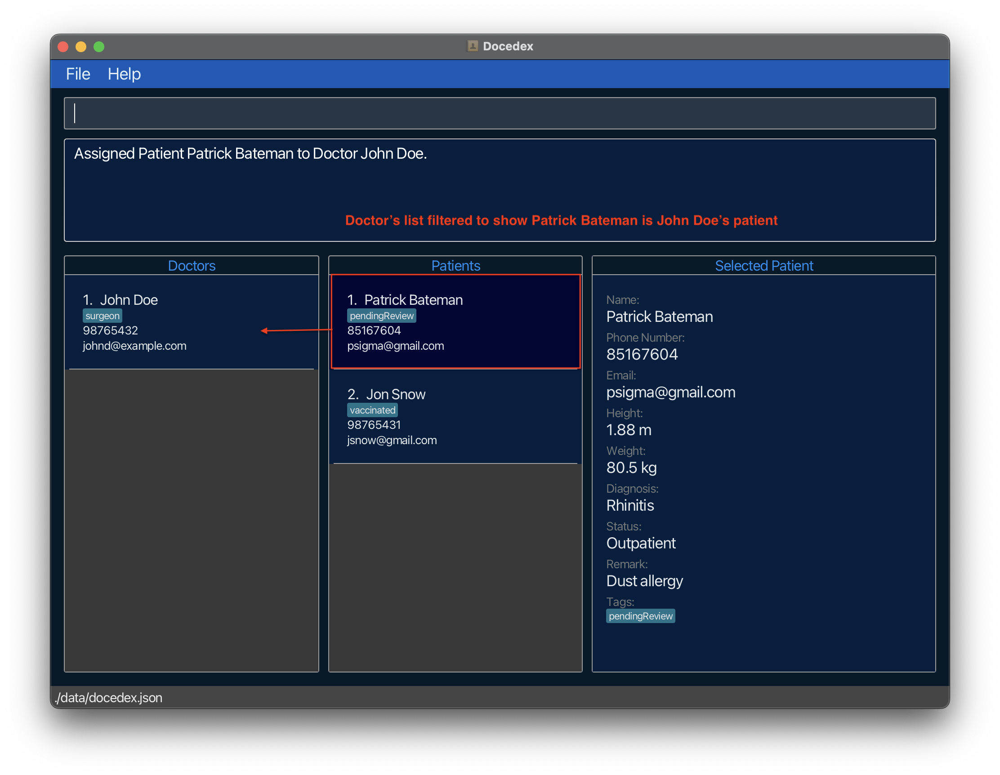
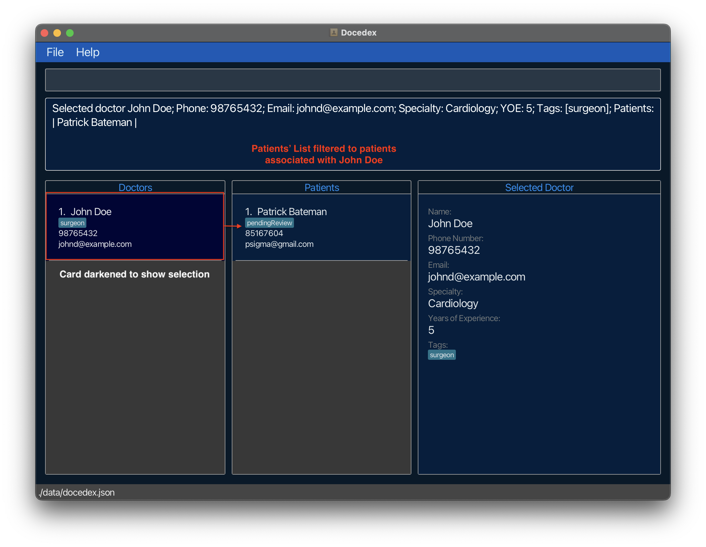
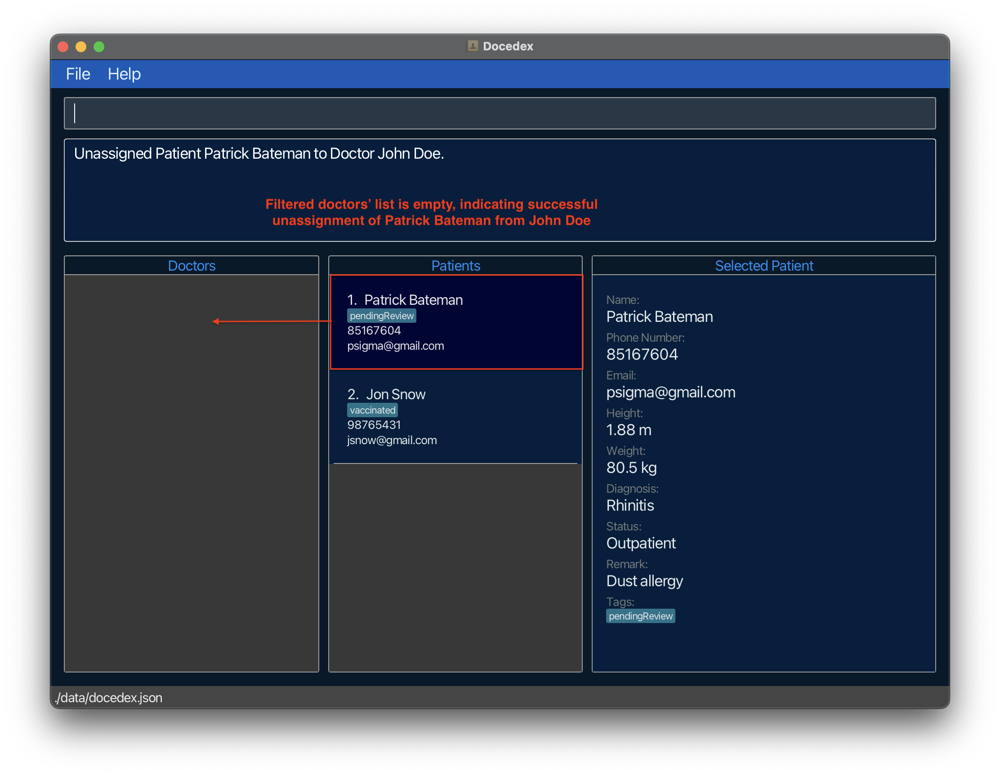
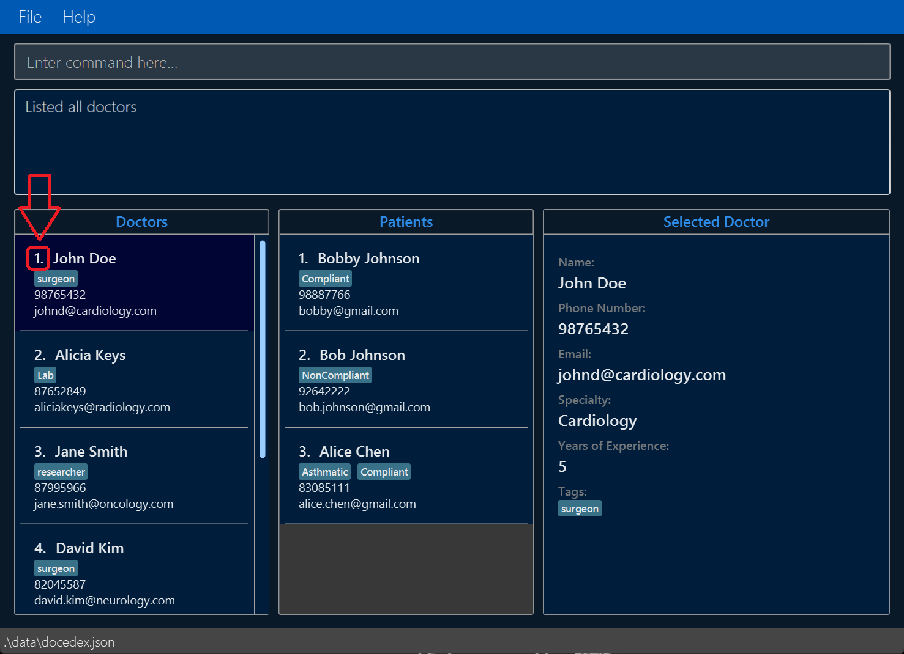

## Welcome to Docedex
{: .no_toc}

***Taking control of hospital administrative management is just a few keystrokes away!***

Docedex is a **desktop application** that enables efficient and secure
management of doctors and patients within clinics. Docedex is built for
**medical administrative assistants** who are also **fast typists**. If you can type fast,
Docedex can get your hospital management tasks done faster than other apps in the industry.

Here's an **overview** of how Docedex can help you streamline your hospital management processes.
- Store and edit information about your patients and doctors
- Track the status of your patients and doctors
- Assign patients to doctors upon triaging

**If you are familiar with Docedex**, jump to our [Table of Contents](#table-of-contents) to find out what
you are looking for!

**If you are new here**, you may visit our [Quick Start](#quick-start) guide to onboard onto Docedex smoothly!



<br>

***How does Docedex make hospital administrative management efficient?***

From our market research, we found that fast typists prefer to do their hospital management
through **the use of single-line text "commands"** that tell Docedex exactly what to do.

For example, let's say that you want to add a doctor named Steve. Docedex allows you to enter
a single line of text specifying your wish to add a doctor named Steve, alongside any other
information about Steve that you wish to store. *(For more information on the usage of these commands,
go to our [Features](#features) section)*

This way, we ensure that ***all critical patient management functionality can be performed
through the keyboard***. Thus, we reduce the amount of time spent switching between the keyboard and mouse
while you perform your duties.

Furthermore, Docedex also comes with a nice visual feedback for our users. Find out more about our user interface
[here](#navigating-the-graphical-user-interface-gui).

## Table of Contents
{: .no_toc}

* Table of Contents
{:toc}

---

## **How can this guide help me?**

If you are a new user, we hope to first inform you on how you can [get started](#quick-start) using Docedex.

As you use Docedex, you may also have questions on how to perform certain actions within the application. This guide thus contains
a comprehensive list of [features](#features) offered with Docedex, as well as explanations on when and how to use them.

Further questions are also answered within a [FAQ](#faq) section below.

Confused about the terms or formatting used in this guide? Learn how to navigate
through this guide [here](#navigating-this-guide).

[Scroll back to Table of Contents](#table-of-contents)

---

## **Navigating this guide**

### Glossary

#### Definitions

Here are some descriptions of the words we use throughout the User Guide:

| Term              | Definition                                                                                                                                                            |
|-------------------|-----------------------------------------------------------------------------------------------------------------------------------------------------------------------|
| **Parameter**     | Parameters are specific details you would include about the doctor/patient. (eg. name, years of experience)                                                           |
| **Command**       | An input from the user that tells Docedex to perform an action (ie. add a doctor).                                                                                    |
| **GUI**           | Graphical User Interface (GUI) represents the visual display of Docedex that users can see.                                                                           |
| **GUI component** | A subsection of the Graphical User Interface. For more information on specific GUI components, refer to [this section](#navigating-the-graphical-user-interface-gui). |
| **CLI**           | Command Line Interface (CLI) represents a text-based user interface to interact with the application.                                                                 |
| **Character**     | Any letter or symbol that is recognized by the computer, and can form a line of text (eg. `a`, `+`, `$`)                                                              |

[Scroll back to Table of Contents](#table-of-contents)

#### Parameter Information

Within the tables below, you can find out more about the parameters that Docedex supports. These parameters come in
handy when crafting commands in Docedex.

Here are some notes about these parameters.
- Each parameter comes with **constraints**. These constraints detail the specific formats of text that
each parameter accepts as valid user input.
  - Not following these constraints will result in an error when
  entering the command.
  - Nonetheless, Docedex will not stop working. Rather, a message will be provided to you on how to correct
  your command.

[Scroll back to Table of Contents](#table-of-contents)

##### Common Parameters

| Parameter           | Description                                                                                                                                  | Constraints                                                                                                                       | Valid Examples                    | Invalid Examples                             |
|---------------------|----------------------------------------------------------------------------------------------------------------------------------------------|-----------------------------------------------------------------------------------------------------------------------------------|-----------------------------------|----------------------------------------------|
| `n/`                | Name of the doctor/patient                                                                                                                   | Alphanumeric characters<br/>(a to z, A to Z, 0 to 9)                                                                              | Will Hunting, Elizabeth 2         | 成龍,  潔 いさぎ 世 よ 一 いち, Ganesh s/o Ravichandran |
| `e/`                | Email of the doctor/patient                                                                                                                  | Format: \<prefix\>@\<domain\><br/><br/>The prefix and domain can contain any alphanumeric character.<br/>(a to z, A to Z, 0 to 9) | whunting@gmail.com, eliz2@mit.edu | whunting@, eliz2                             |
| `p/`                | Phone number of the doctor/patient                                                                                                           | Positive whole number with 3 or more digits                                                                                       | 999, 94565625                     | 0, -1                                        |
| `t/`                | Tag associated with the doctor/patient                                                                                                       | Single string of characters not separated by any whitespace                                                                       | pendingReview, recurrentProblem   | N/A                                          |
| `INDEX`<sup>*</sup> | Index number of the doctor/patient<br/><br/>(Refer to [this image](#docedex-user-interface-with-index-highlighted) for a visual description) | Positive whole number less than or equal to 2147483649                                                                            | 1, 2147483647                     | -1, 2147483650                               |

<sup>*</sup>`INDEX` parameters are sometimes labelled as `PATIENT_INDEX` or `DOCTOR_INDEX` for clarity.

[Scroll back to Table of Contents](#table-of-contents)

##### Doctor Parameters

| Parameter | Description                       | Constraints                                      | Valid Examples        | Invalid Examples                                 |
|-----------|-----------------------------------|--------------------------------------------------|-----------------------|--------------------------------------------------|
| `s/`      | Specialty of the doctor           | Alphanumeric characters (a to z, A to Z, 1 to 9) | Cardiology, Neurology | N/A (45 specialties are recognized in Singapore) |
| `y/`      | Years of experience of the doctor | Positive whole number between 0 and 99.          | 0, 99                 | -1, 100                                          |

[Scroll back to Table of Contents](#table-of-contents)

##### Patient Parameters

| Parameter | Description                             | Constraints                                                                                                                                          | Valid Examples                      | Invalid Examples   |
|-----------|-----------------------------------------|------------------------------------------------------------------------------------------------------------------------------------------------------|-------------------------------------|--------------------|
| `h/`      | Height of the patient in metres (m)     | 3-digit number with 2 decimal places representing patient's height in metres                                                                         | 1.63, 1.99                          | 1, 1.2, 1.234      |
| `w/`      | Weight of the patient in kilograms (kg) | Number with an optional 1 decimal place representing patient's weight in kg                                                                          | 85.0, 63.2                          | -85, 63.20         |
| `d/`      | Diagnosis                               | Alphanumeric characters<br/>(a to z, A to Z, 0 to 9)                                                                                                 | Fever, Cancer                       | 发烧                 |
| `st/`     | Status                                  | Can only take one of the following values:<br/><br/>Inpatient, Outpatient, Observation, Emergency Department, Intensive Care Unit, Transitional Care | Inpatient, Outpatient               | Baymax, HelloWorld |
| `r/`      | Remark                                  | Alphanumeric characters<br/>(a to z, A to Z, 0 to 9).                                                                                                | Compliant, Needs increase in dosage | 发烧                 |

[Scroll back to Table of Contents](#table-of-contents)

### Format

#### General Formatting

Here are the explanations behind the formatting we use throughout this guide!

| Format                                                                    | Explanation                                                                                                                                                             |
|---------------------------------------------------------------------------|-------------------------------------------------------------------------------------------------------------------------------------------------------------------------|
| Words in `code blocks`                                                    | These represent any of the following:<br/>1. Text used in commands, such as `add-doc`<br/>2. Keys on your keyboard like `Enter`<br/>3. File names such as `docedex.jar` |
| <div markdown="span" class="alert alert-danger">Text within a red box     | These usually represent major warnings. Not following these warnings may cause major errors within Docedex. (ie. Having all data cleared from Docedex)                  |
| <div markdown="span" class="alert alert-warning">Text within a yellow box | These usually represent minor warnings. Not following these warnings may cause minor inconveniences within Docedex. (ie. Editing patient data incorrectly)              |
| <div markdown="span" class="alert alert-info">Text within a blue box      | These usually represent any other additional notes for users.                                                                                                           |

[Scroll back to Table of Contents](#table-of-contents)

#### Command Format

Here are the explanations behind the formatting we use within our commands!

| Format                                                                                                  | Explanation                                                                  | Examples                                                                                          |
|---------------------------------------------------------------------------------------------------------|------------------------------------------------------------------------------|---------------------------------------------------------------------------------------------------|
| Words in `UPPER_CASE`                                                                                   | These are parameter values that are supplied by the user                     | `add-doc n/NAME...` can be used as `add-doc n/John Doe...`                                        |
| Items in square brackets                                                                                | These are optional parameters (can be left empty by user)                    | `add-doc n/NAME ... [t/TAG]` can be used as `add-doc n/John Doe t/level5` or `add-doc n/John Doe` |
| Items with `…`​ after them                                                                              | These are parameters that can be used multiple times (or omitted completely) | `add-doc ... [t/TAG]…​` can be used as `add-doc ... t/level5 t/surgeon` or `add-doc ...`          |

[Scroll back to Table of Contents](#table-of-contents)

---

## **Quick start**

1. Make sure that you have **Java 11 or above** installed on your computer.
    - [How do I check my version of Java?](#checking-java-version)
      <br><br>
2. Download the latest jar file (`docedex.jar`) from our [GitHub Releases](https://github.com/AY2223S2-CS2103T-F12-1/tp/releases/).
   
   <br><br>
3. Move the jar file to a folder where you want to store the data of the doctors and patients.
    - Create a new folder called (you can name it Docedex) where you would like to house the application (e.g., Desktop, Documents, etc.).
    - Move the downloaded `docedex.jar` file to this folder as shown below.
        - For Mac Users:
          
          <br><br>
        - For Windows Users:
          
          <br><br>
4. Launch Docedex
    - For Mac Users:
        - Open a new Terminal window by following the instructions below.
            - Press `Command ⌘` and `Space` keys together.
            - Type "Terminal".
            - Hit the `Enter` key.
        - Navigate to the folder where you have stored the jar file using the `cd` command.
            - For example, if you have stored the jar file in a folder called Docedex, you can type `cd Docedex` and press Enter.
        - Type `java -jar docedex.jar` and press Enter.
    - For Windows Users:
        - Double-click `docedex.jar` to launch the application.
    - If this still does not work follow the instructions listed [here](#launching-docedex).
    - You should notice the GUI of the application pop up.
      <br><br>

5. Learn more about navigating the GUI [here](#navigating-the-graphical-user-interface-gui).

6. For **new users**, learn to use Docedex through our [Tutorial](#docedex-tutorial-for-new-users).
   - We also highly recommend looking through the section on [navigating this guide](#navigating-this-guide)
   to better understand the terminology and formats used in this guide.

7. For **advanced users**, view the specifics regarding what Docedex can do for you
   in our [Features](#features) section.

<div markdown="span" class="alert alert-danger">
**WARNING TO ALL MAC USERS** <br/>
It is  possible to right click <code>docedex.jar</code> and open it with <code>JavaLauncher.app</code>.<br/>
However, doing so <strong>will result in improper loading of data</strong> into Docedex. Therefore, it is recommended
to use follow the instructions stated above instead.
</div>

[Scroll back to Table of Contents](#table-of-contents)

---

## **Navigating the Graphical User Interface (GUI)**

Docedex comes with a GUI to allow for a nice visual feedback for our users. Here
is a quick run-through of the different sections of our GUI, as well as some notes
regarding the use of the GUI.

### Quick Orientation



Here is a quick summary of each GUI component within Docedex.

| **Name of component** | **Description**                                                                                                                                                                                                                                                             |
|-----------------------|-----------------------------------------------------------------------------------------------------------------------------------------------------------------------------------------------------------------------------------------------------------------------------|
| **Menu Bar**          | Contains dropdown menu options for the Docedex application.                                                                                                                                                                                                                 |
| **Command Box**       | Allows users to enter Docedex commands.                                                                                                                                                                                                                                     |
| **Result Display**    | Provides CLI-based feedback upon a user command.<br>Allows users to see if their command was successful or not.<br>Provides error messages to guide user on how to use Docedex commands.                                                                                    |
| **Doctor List**       | Shows a list of **Doctor Cards**. This list can be manipulated through commands.<br><br>Upon starting the app, this list will reflect all doctors in Docedex.<br><br>Upon selection of a **Patient Card**, this list will filter to show doctors assigned to said patient.  |
| **Doctor Card**       | Displays key information about a doctor, such as name, phone number, email and tags.                                                                                                                                                                                        |
| **Patient List**      | Shows a list of **Patient Cards**. This list can be manipulated through commands.<br><br>Upon starting the app, this list will reflect all patients in Docedex.<br><br>Upon selection of a **Doctor Card**, this list will filter to show patients assigned to said doctor. |
| **Patient Card**      | Displays key information about a patient, such as name, phone number, email and tags.                                                                                                                                                                                       |
| **Information Card**  | Displays all information about a selected doctor or patient.                                                                                                                                                                                                                |
| **Footer**            | Shows the location of the Docedex storage.                                                                                                                                                                                                                                  |

[Scroll back to Table of Contents](#table-of-contents)

### Notes about the GUI

#### Selecting doctors or patients through commands

Certain commands involve the selection of doctors
and patients immediately after they are entered.

For example, when you type in the [`add-doc`](#adding-a-doctor) command, Docedex will automatically select
the newly added doctor and display their details to you. This gives the user (you!)
a nice visual feedback that the command is successful.

Upon selecting a doctor, the Patient List displays the patients assigned
to the selected doctor. However, if the doctor is newly added, said doctor will have
no patients, and thus the Patient List will be empty.

This behaviour will also exist if the user adds a patient instead too.

<div markdown="span" class="alert alert-danger">
    :exclamation: Some users have mentioned being alarmed by <strong>sudden disappearances of
    their Doctor Cards and Patient Cards</strong> within their respective lists
    after entering certain commands. The explainer above details why this happens.
    <br/><br/>
    Fret not, as this is part of the functionality of Docedex.
    <br/><br/>
    <b><em>Your storage is still secure.</em></b>
</div>

[Scroll back to Table of Contents](#table-of-contents)

#### Unselecting doctors or patients

Unselecting doctors and patients is currently not supported in Docedex. If you wish to
look through all the doctors and patients in Docedex, please use the
[`list-doc`](#listing-all-doctors) and [`list-ptn`](#listing-all-patients) commands instead.

[Scroll back to Table of Contents](#table-of-contents)

---

## **Docedex Tutorial (for new users)**

This is a tutorial for **first-time** Docedex users.
1. Launch Docedex. You may refer to the instructions [here](#quick-start)
   - Note: On launch, Docedex will not contain any doctor or patient records.
2. Let us try **adding a doctor** to our Docedex. Enter the command `add-doc n/John Doe p/98765432 e/johnd@example.com s/Cardiology y/5 t/surgeon` in the command box.
   - Note: On adding a new doctor, the patients' list is filtered to show only patients associated with the doctor. To view all patient records, simply type `list-ptn` in the command box.
     
3. Let us try **adding a patient** to our Docedex. Enter the command `add-ptn n/Patrick Bateman p/85167604 e/psigma@gmail.com h/1.88 w/80.5 d/Rhinitis st/Outpatient r/Dust allergy t/pendingReview` in the command box.
   - Note: On adding a new patient, the doctors' list is filtered to show only doctors associated with the patient. To view all doctor records, simply type `list-doc` in the command box.
     
4. Add a few more doctors and patients to Docedex!
5. Let us try **assigning the patient to the doctor**. Enter the command `assign-ptn ptn/1 doc/1` in the command box.
   - Note: On assigning a patient to a doctor, the doctors' list is filtered to show only doctors associated with the patient. To view all doctor records, simply type `list-doc` in the command box.
     
6. Let us try **selecting the doctor**. Enter the command `sd 1` in the command box.
   - Note: On selecting the doctor, the patients' list is filtered to display only patients associated with the doctor. To view all patients use `list-ptn`.
     
7. Let us try **selecting the patient**. Enter the command `sp 1` in the command box. This time, the doctors' list is filtered instead.
   - Note: On selecting the patient, the doctors' list is filtered to display only patients associated with the patient. To view all doctors use `list-doc`.
8. Let us try **undoing the assignment of the patient from the doctor**. Enter the command `unassign-ptn ptn/1 doc/1` in the command box.
   
9. Let us try **finding a doctor** named John. Enter the command `find-doc n/John` in the command box.
10. Let us try **finding a patient** with the name Patrick. Enter `find-ptn n/Patrick` in the command box.
11. Let us try **deleting a doctor** from Docedex. Enter the command `del-doc 1` in the command box. This removes the first displayed doctor in the doctors' list.
12. Let us try **deleting a patient** from Docedex. Enter the command `del-ptn 1` in the command box. This removes the first displayed patient in the patients' list.
13. Let us try **listing all doctors**. Enter the command `list-doc` in the command box. This lists all the doctors within Docedex.
14. Let us try **listing all patients**. Enter the command `list-ptn` in the command box. This lists all the patients within Docedex.
15. Congratulations! You are now ready to use Docedex.

  To view all our features, you may visit our [features section](#features).

[Scroll back to Table of Contents](#table-of-contents)

---

## **Command Summary**

| Command               | Shorthand   | What it does                                                                                                  |
|-----------------------|-------------|---------------------------------------------------------------------------------------------------------------|
| `add-doc / add-ptn`   | `ad / ap`   | Adds a doctor or patient into Docedex.                                                                        |
| `edit-doc / edit-ptn` | `ed / ep`   | Edits the specified doctor or patient.                                                                        |
| `del-doc / del-ptn`   | `dd / dp`   | Removes the specified doctor or patient from Docedex. **This action cannot be undone.**                       |
| `find-doc / find-ptn` | `fd / fp`   | Finds the doctor(s) and patient(s) based on specific parameters. (ie. Find all doctors named Smith")          |
| `list-doc / list-ptn` | `lsd / lsp` | Lists all doctors or patients within Docedex.                                                                 |
| `assign-ptn`          | `asn`       | Assigns a patient to a doctor.                                                                                |
| `unassign-ptn`        | `uasn`      | Remove the assignment of the specified patient to the specified doctor.                                       |
| `sd / sp`             | `sd / sp`   | Selects the specified doctor or patient and displays the selected person's information on the user interface. |
| `help`                | N/A         | Displays the link to the User Guide.                                                                          |
| `clear`               | N/A         | Clears all doctors and patients within Docedex. **This action cannot be undone.**                             |
| `exit`                | N/A         | Exits the application (equivalent to closing the application).                                                |

<br>
Here are some notes about the behaviour of our commands!

| Notes                                                                                                        | Examples                                                                             |
|--------------------------------------------------------------------------------------------------------------|--------------------------------------------------------------------------------------|
| Parameters are accepted in any order.                                                                        | `add-doc n/NAME p/PHONE_NUMBER ...` is equivalent to `add-doc p/PHONE_NUMBER n/NAME` |
| If a parameter is **expected only once** but entered multiple times, only the latest occurrence is accepted. | `add-doc n/John Doe n/Shawn Koh ...` is equivalent to `add-doc n/Shawn Koh ...`      |
| Extraneous parameters for commands that do not take in parameters will be ignored.                           | `help 123`, `list 123` is equivalent to `help` or `list`                             |


[Scroll back to Table of Contents](#table-of-contents)

---

## **Features**

### Doctor Commands
#### Adding a doctor

**Wish to add a new doctor who has joined your department?** Use the `add-doc` command!

***Command format***
<br>
```add-doc n/NAME p/PHONE_NUMBER e/EMAIL s/SPECIALITY y/YEARS_OF_EXPERIENCE [t/TAGS]…```
<br>

***What does it do?***
- Adds a new doctor to the *doctors list* in Docedex.

***Examples***
- `add-doc n/John Doe p/98765432 e/johnd@example.com s/Cardiology y/5 t/surgeon`
  - Adds a doctor named John Doe, with the specified information.
- `add-doc n/Gabriel Tan p/98765432 e/gabt@example.com s/Neurosurgery y/5`
  - Adds a doctor named Gabriel Tan, with the specified information.
  - Note that the tag is optional.

<div markdown="span" class="alert alert-info">
    <strong>If your <em>patients list</em> seems to disappear</strong> after entering this command, fret not! Click
    <a href="#selecting-doctors-or-patients-through-commands"><strong>here</strong></a>
    to find out why this happens.
</div>
<div markdown="span" class="alert alert-info">
    Don't know what each parameter stands for? Refer to our guide on the <a href="#parameter-information">Parameter Information</a>.
    <br/><br/>
    Confused regarding the command format? Refer to our guide on the <a href="#command-format">Command Format</a>.
    <br/><br/>
    Not sure of the terminology used? Refer to our <a href="#glossary">Glossary</a> for the definitions of terms used
    and <a href="#quick-orientation">Quick Orientation</a> to the GUI for the definitions of GUI components.
</div>

[Scroll back to Table of Contents](#table-of-contents)

#### Editing a doctor

**Wish to change the email of an existing doctor?** Use the `edit-doc` command!

***Command format***
<br>
```edit-doc INDEX [n/NAME] [p/PHONE_NUMBER] [e/EMAIL] [s/SPECIALTY] [y/YOE] [t/TAGS]…```
<br>

<div markdown="span" class="alert alert-warning">
**WARNING**: This command overwrites existing data within Docedex, proceed with caution.
</div>

***What does it do?***
- Edits the information of the doctor at the specified `INDEX` using any
new supplied parameters.

***Additional notes***
- At least one parameter must be provided to the command.
  - Not providing any parameters (such as typing ```edit-doc 1```) will result in an error message.
- Only parameters specified in the command will be updated.
  - All other information about the doctor will remain the same.
- When editing tags, you have to include any previous tags that was already associated with the doctor.
  - Not doing so will result in these tags being removed.
  - Type `t/` once, leaving the text for the tag empty, to remove all tags from a doctor.

***Examples***
- `edit-doc 1 p/91234567`
  - Edits the phone number of the 1st doctor to be `91234567`.
- `edit-doc 2 n/Gabriel Tan p/12345678 t/`
  - Edits the name and phone number of the 2nd doctor to be `Gabriel Tan` and `91234567` respectively.
  - Adding `t/` also clears all existing tags.

<div markdown="span" class="alert alert-info">
    <strong>If your <em>patients list</em> seems to disappear</strong> after entering this command, fret not! Click
    <a href="#selecting-doctors-or-patients-through-commands"><strong>here</strong></a>
    to find out why this happens.
</div>
<div markdown="span" class="alert alert-info">
    Don't know what each parameter stands for? Refer to our guide on the <a href="#parameter-information">Parameter Information</a>.
    <br/><br/>
    Confused regarding the command format? Refer to our guide on the <a href="#command-format">Command Format</a>.
    <br/><br/>
    Not sure of the terminology used? Refer to our <a href="#glossary">Glossary</a> for the definitions of terms used
    and <a href="#quick-orientation">Quick Orientation</a> to the GUI for the definitions of GUI components.
</div>

[Scroll back to Table of Contents](#table-of-contents)

#### Deleting a doctor

**Wish to remove a doctor who no longer works at your clinic?** Use the `del-doc` command!

***Command format***
<br>
```del-doc INDEX```
<br>

<div markdown="span" class="alert alert-danger">
**WARNING**: This command is cannot be undone, and there is no way to recover the deleted doctor's information.
</div>

***What does it do?***
- Deletes the doctor at the specified `INDEX`.

***Additional notes***
- If the doctor you wish to delete is not shown on the *doctors list*, you can try
using [`list-doc`](#listing-all-doctors) to list out all the doctors in Docedex first.

***Examples***
- `del-doc 2`
  - Deletes the 2nd doctor displayed in the *doctors list* within Docedex.

<div markdown="span" class="alert alert-info">
    Don't know what each parameter stands for? Refer to our guide on the <a href="#parameter-information">Parameter Information</a>.
    <br/><br/>
    Confused regarding the command format? Refer to our guide on the <a href="#command-format">Command Format</a>.
    <br/><br/>
    Not sure of the terminology used? Refer to our <a href="#glossary">Glossary</a> for the definitions of terms used
    and <a href="#quick-orientation">Quick Orientation</a> to the GUI for the definitions of GUI components.
</div>

[Scroll back to Table of Contents](#table-of-contents)

#### Finding a doctor

**Wish to find a doctor with at least 5 years of experience?** Use the `find-doc` command!

***Command format***
<br>
```find-doc [n/NAME] [p/PHONE_NUMBER] [e/EMAIL] [s/SPECIALTY] [y/YEARS_OF_EXPERIENCE] [t/TAGS]…```
<br>

***What does it do?***
- Finds all doctors in Docedex that match the specified parameter values, and displays
those doctors to the user within the *doctors list*.

***Additional notes***
- The specified parameter values can be case-insensitive.
  - So if there is a doctor named *Gabriel* in Docedex,
      entering the command `find-doc n/GAbRiEl` will still display the requested doctor.
- If the parameter value searched by the user is contained within the parameter value of a doctor, that doctor
will be displayed to the user.
  - So if there are two doctors named *Gabriel* and *Gabriella* in Docedex,
  entering the command `find-doc n/Gabriel` will display both doctors.
  - This happens as both the names *Gabriel* and *Gabriella* contain the word *Gabriel*
- At least one of the parameters must be provided.
  - Not providing any parameters (such as typing ```find-doc```) will result in an error message.
- More than one tag can be provided in the command.
  - ```find-doc t/surgeon t/level5``` is a valid command.
- Blank parameters will be ignored.
  - Typing ```find-doc n/Gabriel p/``` is equivalent to ```find-doc n/Gabriel```.

***Examples***
- `find-doc n/Gabriel`
  - Finds and displays all doctors whose names contain the word `Gabriel`.
- `find-doc n/Gabriel t/friend t/expert`
  - Finds and displays all doctors whose names contain the word `Gabriel`, and have the tags `friend` and `expert`.
- `find-doc y/3`
  - Finds and displays all doctors that have the number *3* in their years of experience.
  - So, any doctor with 3, 30 or 23 years of experience will be displayed.

<div markdown="span" class="alert alert-info">
    Don't know what each parameter stands for? Refer to our guide on the <a href="#parameter-information">Parameter Information</a>.
    <br/><br/>
    Confused regarding the command format? Refer to our guide on the <a href="#command-format">Command Format</a>.
    <br/><br/>
    Not sure of the terminology used? Refer to our <a href="#glossary">Glossary</a> for the definitions of terms used
    and <a href="#quick-orientation">Quick Orientation</a> to the GUI for the definitions of GUI components.
</div>

[Scroll back to Table of Contents](#table-of-contents)

#### Select doctor

**Wish to click on a *doctor card* to view more information about them without using a mouse?**
Use the `sd` command!

***Command format***
<br>
```sd INDEX```
<br>

***What does it do?***
- Performs a mouse click on the *doctor card* of the doctor at the specified `INDEX`.
  - This displays all information about the doctor within the *contact card*.
  - It also filters the *patients list* to only show patients assigned to this doctor.

***Examples***
- `sel-doc 1`
    - Performs a mouse click on the *doctor card* of the doctor with displayed index of 1.

<div markdown="span" class="alert alert-info">
    <strong>If your <em>patients list</em> seems to disappear</strong> after entering this command, fret not! Click
    <a href="#selecting-doctors-or-patients-through-commands"><strong>here</strong></a>
    to find out why this happens.
</div>
<div markdown="span" class="alert alert-info">
    Don't know what each parameter stands for? Refer to our guide on the <a href="#parameter-information">Parameter Information</a>.
    <br/><br/>
    Confused regarding the command format? Refer to our guide on the <a href="#command-format">Command Format</a>.
    <br/><br/>
    Not sure of the terminology used? Refer to our <a href="#glossary">Glossary</a> for the definitions of terms used
    and <a href="#quick-orientation">Quick Orientation</a> to the GUI for the definitions of GUI components.
</div>

[Scroll back to Table of Contents](#table-of-contents)

#### Listing all doctors

**Wish to look through all doctors within your clinic?**
Use the `list-doc` command!

***Command format***
<br>
```list-doc```
<br>

***What does it do?***
- Lists all doctors within the *doctors list* in Docedex.
    
<div markdown="span" class="alert alert-info">
    Don't know what each parameter stands for? Refer to our guide on the <a href="#parameter-information">Parameter Information</a>.
    <br/><br/>
    Confused regarding the command format? Refer to our guide on the <a href="#command-format">Command Format</a>.
    <br/><br/>
    Not sure of the terminology used? Refer to our <a href="#glossary">Glossary</a> for the definitions of terms used
    and <a href="#quick-orientation">Quick Orientation</a> to the GUI for the definitions of GUI components.
</div>

[Scroll back to Table of Contents](#table-of-contents)

### Patient Commands

#### Adding a patient

```add-ptn n/NAME p/PHONE e/EMAIL h/HEIGHT w/WEIGHT d/DIAGNOSIS st/STATUS [r/REMARK] [t/TAGS]…```
- To view parameter information click [here](#parameter-information)
- Possible use cases: Adding a new patient visiting a clinic to the address book.
- What it does: Adds a new patient to the patients' list and filters the doctors' list to show only associated doctors.

- Examples:
  - `add-ptn n/Patrick Bateman p/85167604 e/psigma@gmail.com h/1.88 w/80.5 d/Rhinitis st/Outpatient r/Dust allergy t/brother`
  - `add-ptn n/Patrick Bateman p/85167604 e/psigma@gmail.com h/1.88 w/80.5 d/Rhinitis st/Outpatient`

<div markdown="span" class="alert alert-info">
Adding patient command, also calls select patient to display the recently added information in the Enlarged Contact Card.
**If no doctors appear in the doctors list**, it is because the patient has not been assigned to any doctor.

For more information see: [Selecting doctors or patients through commands](#selecting-doctors-or-patients-through-commands)
</div>

[Scroll back to Table of Contents](#table-of-contents)

#### Assigning a patient to a doctor

```assign-ptn ptn/PATIENT_INDEX doc/DOCTOR_INDEX```
- To view parameter information click [here](#parameter-information)
- What it does: Performs an assignment operation and filters the doctors' list to show only the doctors associated with the patient.
- Possible use cases: Assigning a newly arrived patient to an available doctor.
- Examples:
  - `assign-ptn ptn/1 doc/1` assigns the first patient to the first doctor.

<div markdown="span" class="alert alert-info">
Assign patient command, also calls select patient to display the recently added information in the Enlarged Contact Card.
The doctors that appear in the doctors list, are those that the patient has been assigned to.

For more information see: [Selecting doctors or patients through commands](#selecting-doctors-or-patients-through-commands)
</div>

[Scroll back to Table of Contents](#table-of-contents)

#### Undoing assignment of a patient from a doctor

```unassign-ptn ptn/PATIENT_INDEX doc/DOCTOR_INDEX```
- To view parameter information click [here](#parameter-information)
- What it does: Undoes the assignment of a patient from a doctor. Filters the doctors list to highlight only doctors associated with the patient.
- Possible use cases: Transferring a patient's case from one doctor to another
- Examples:
  - `unassign-ptn ptn/1 doc/1` undoes the assignment of the first patient from the first doctor.

<div markdown="span" class="alert alert-info">
Unassign (undo assignment) patient command, also calls select patient to display the recently added information in the Enlarged Contact Card.
The doctors that appear in the doctors list, are those that the patient has been assigned to (if no doctors are displayed, the patient is assigned to no doctors).

For more information see: [Selecting doctors or patients through commands](#selecting-doctors-or-patients-through-commands)
</div>

[Scroll back to Table of Contents](#table-of-contents)

#### Editing a patient

```edit-ptn [INDEX] [n/NAME] [p/PHONE] [e/EMAIL] [h/HEIGHT] [w/WEIGHT] [d/DIAGNOSIS] [st/STATUS] [r/REMARK] [t/TAGS]…```
- To view parameter information click [here](#parameter-information)
- What it does: Edits the patient at the specified `INDEX`.
<div markdown="span" class="alert alert-warning">
**WARNING**: This command overwrites existing data within Docedex, proceed with caution.
</div>

- Note to users:
    - The index refers to the index number shown in the displayed patient list.
    - Users can edit specific patients in the clinic by providing at least one of the optional parameters. Specified parameters will be updated to the input values and all other parameter values will remain the same.
    - At least one of the optional parameters must be provided.
    - When editing tags, you have to include any previous tags that was already included in the patient, or else these tags will be removed. This also means that you can use `t/` to remove all tags from a doctor using the `edit-doc` command.


- Examples:
    - `edit-ptn 1 n/Daenerys Targaryen` Edits the name of the 1st patient to be `Daenerys Targaryen`.
    - `edit-ptn 2 n/Daenerys Targaryen st/Inpatient t/` Edits the name and status of the 2nd patient to be `Daenerys Targaryen` and `Inpatient` respectively. Adding t/ also clears all existing tags.

<div markdown="span" class="alert alert-info">
Edit patient command, also calls select patient to display the recently updated information in the Enlarged Contact Card.
The doctors that appear in the doctors list, are those that the patient has been assigned to (if no doctors are displayed, the patient has not been assigned to any doctor). 
<br/>
For more information see: [Selecting doctors or patients through commands](#selecting-doctors-or-patients-through-commands)
</div>

[Scroll back to Table of Contents](#table-of-contents)

#### Deleting a patient
- Command format: `del-ptn INDEX`
- What it does: Deletes the specified patient from the address book.
<div markdown="span" class="alert alert-danger">
**WARNING**: This command is destructive. Patients removed will need to be added back.
</div>
- Note to user:
  - The index refers to the index number shown in the displayed patient list.

Examples:
* `list-ptn` followed by `del-ptn 2` deletes the 2nd patient in the address book.
* `find-ptn Gabriel` followed by `del-ptn 1` deletes the 1st patient in the results of the `find-ptn` command.

[Scroll back to Table of Contents](#table-of-contents)

#### Finding a patient

```find-ptn [n/NAME] [p/PHONE] [e/EMAIL] [h/HEIGHT] [w/WEIGHT] [d/DIAGNOSIS] [st/STATUS] [r/REMARK] [t/TAGS]…```
- To view parameter information click [here](#parameter-information)
- What it does: Find patients with specified parameter value
- Possible use cases: Retrieval of patient records
- Note to user:
    - Matches are case-insensitive.
    - Parameters are matched if they contain the search value (if there are two patients named Gabriel and Gabriella in Docedex, using the command with search value `n/Gabriel` retrieves both records).
    - At least one of the parameters must be provided.
    - More than one tag can be provided.
    - Blank parameters will be ignored.
    - Please follow the parameter constraints closely, or you will not retrieve any patients.

- Examples:
  - `find-ptn n/Alice` matches any patient with the name containing the word `Alice`.
  - `find-ptn h/1` match any patient with the height containing the number `1`, i.e. `1.70` and `0.91` will be matched but `0.99` and `2.00` will not be matched.

[Scroll back to Table of Contents](#table-of-contents)

#### Select patient

```sp INDEX```

- To view parameter information click [here](#parameter-information)
- What it does: This command mimics a mouse click on a patient's contact card. It shows the information of the patient and filters the doctors' list to only show assigned doctors.
- Possible use cases: Find which doctors treated a patient
- Note to user:
    - The index refers to the index number shown in the displayed patient list.

<div markdown="span" class="alert alert-info">
Selecting patient command only displays the recently queried patients' information in the Enlarged Contact Card.
**If no doctors appear in the doctors list**, it is because the patient has not been assigned to any doctor.

For more information see: [Selecting doctors or patients through commands](#selecting-doctors-or-patients-through-commands)
</div>

[Scroll back to Table of Contents](#table-of-contents)

#### Listing all patients

`list-ptn`
- Possible use cases: Retrieval of all patients in Docedex after commands involving selection.
- What it does: Lists all patients in Docedex.

For more information see: [Selecting doctors or patients through commands](#selecting-doctors-or-patients-through-commands)

[Scroll back to Table of Contents](#table-of-contents)

### Common Commands
#### Viewing help

- Command format: `help`
- What it does: Shows a message explaining how to access this help page.

[Scroll back to Table of Contents](#table-of-contents)

#### Exiting the program
- Command format: `exit`
- What it does: This command is equivalent to closing the application (exits the program).

[Scroll back to Table of Contents](#table-of-contents)

#### Clearing all data
- Command format: `clear`
- What it does: This command will clear all data in Docedex.
<div markdown="span" class="alert alert-danger">
**WARNING**
  - This command will clear all data in Docedex. This includes all doctors and patients.
  - This command **cannot be undone**.
</div>

[Scroll back to Table of Contents](#table-of-contents)

### Saving the data

Docedex data is saved automatically after any command that changes data. There is no need to save manually.

[Scroll back to Table of Contents](#table-of-contents)

### Editing the data file

Docedex data is saved as a JSON file at this specified path: `[JAR file location]/data/docedex.json`.

DO NOT modify data directly, as it might result in the malfunction of the application. In the worst case scenario, all your data may be reset. Only modify data directly if you know what you are doing and accept the risks of such actions.

[Scroll back to Table of Contents](#table-of-contents)

---

## **FAQ**

### Launching Docedex
**Q**: How can I launch docedex if the clicking on the JAR file does not work?<br>
**A**: There are two possible methods to launch Docedex.

Method 1: For users familiar with the command prompt
1. Open the command prompt
2. Navigate to the directory where the JAR file is located using `cd [JAR file location]`
3. Type `java -jar docedex.jar` and press enter
4. Docedex should launch

Method 2: For users that wish to create a script to launch Docedex (**Recommended**)
1. Create a new text file
2. Copy and paste the following into the text file:
```
java -jar [JAR file location]/docedex.jar
```
3. Save the text file as `docedex.bat` (Windows) or `docedex.sh` (macOS/Linux)
4. Change the admin settings of the script to allow it to run as a program:
   1. Windows: Right-click on the script and select `Properties`. Under `General`, check the box that says `Allow this file to run as a program`.
   2. MacOS/Linux: Open the terminal and navigate to the directory where the script is located. Type `chmod +x [script name]` and press enter. (`chmod +x` changes permissions of the script to allow it to be executed.)
5. Double-click on the script to launch Docedex
6. Docedex should launch

If you have any further issues, please raise an issue on our [GitHub page](https://github.com/AY2223S2-CS2103T-F12-1/tp/issues). We will attend to you as soon as we can.

### Checking Java version
**Q**: How can I check my Java version?<br>
**A**: Open a command prompt and type `java -version`. If you do not have Java installed, you can download it [here](https://www.oracle.com/java/technologies/javase-jdk11-downloads.html).

For Mac Users you may wish to follow the instructions listed [here](https://nus-cs2103-ay2223s2.github.io/website/admin/programmingLanguages.html)

### Loading Data from another computer

**Q**: How can I load data from another computer into Docedex installed on another computer?<br>
**A**: Delete the `docedex.json` file (stored at `[JAR file location]/data/docedex.json`) from the computer that you wish to use Docedex on. Then, copy over the `docedex.json` file from the computer which you no longer wish to use Docedex on. After which, boot up Docedex to check whether your doctor information is properly loaded into the new computer.

### Using Docedex
**Q**: I entered a command and my doctor/patient list was cleared. What happened?<br>
**A**: Refer to the subsection titled
[Selecting doctors or patients through commands](#selecting-doctors-or-patients-through-commands)
for an explanation of why this occurs.

[Scroll back to Table of Contents](#table-of-contents)

---

## **Appendix A: Relevant Images**

### Docedex User Interface with Index Highlighted
{: .no_toc}

The **red box** represents the index of a doctor/patient.



[Scroll back to Table of Contents](#table-of-contents)